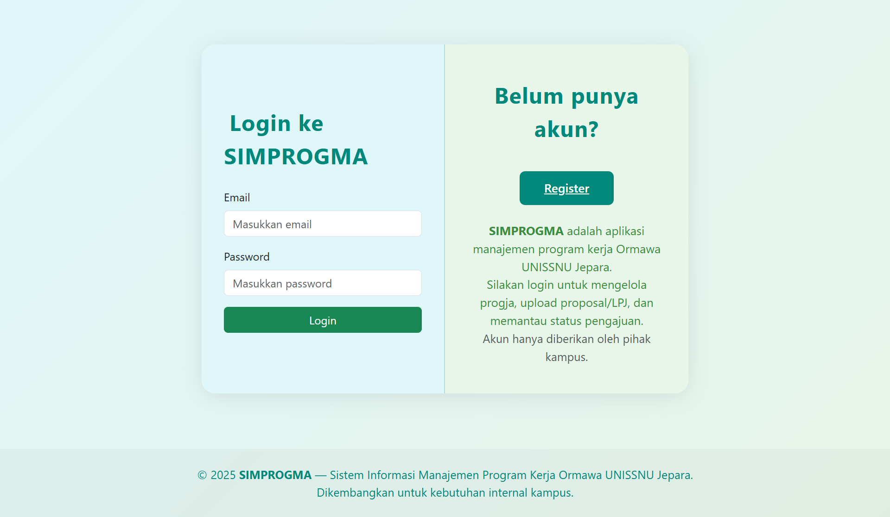

# SIMPROGMA

Sistem Informasi Manajemen Program Kerja Ormawa (SIMPROGMA)
===========================================================

Aplikasi web untuk mengelola program kerja Ormawa UNISNU Jepara. Mendukung fitur login/register, manajemen program kerja, upload proposal & LPJ, status verifikasi, dashboard admin & user, dan banyak lagi.

---

## ✨ **Fitur Utama**
- **Login & Register** untuk Ormawa dan Admin
- **CRUD Program Kerja (Progja)**: tambah, edit, hapus, lihat detail
- **Upload Proposal & LPJ** dengan validasi file
- **Status Verifikasi**: Menunggu, ACC, Tolak, Revisi
- **Dashboard Admin**: monitoring seluruh pengajuan Ormawa
- **Dashboard Ormawa**: status pengajuan, upload laporan, edukasi progja
- **Role-based Access**: admin/user, middleware pembatasan akses
- **Relasi antar tabel**: user → progja → file/laporan
- **Validasi form** dan pesan error
- **Tampilan modern**: gradasi, card, icon, responsive

---

## 📸 **Screenshot Aplikasi**

### Halaman Login


### Dashboard User


### Daftar Program Kerja


### Upload Proposal


### Dashboard Admin


### Admin - Kelola Status Progja


> 📁 **Screenshot lengkap** tersedia di folder [`screenshots/`](screenshots/) yang mencakup:
> - Halaman Login & Register
> - Dashboard User & Admin
> - CRUD Program Kerja (tambah, edit, hapus, detail)
> - Upload Proposal & LPJ
> - Popup status (Draft, Diajukan, Sedang Dikoreksi, Disetujui)
> - Keterangan Revisi dari Admin
> - Dan lainnya...

---

## 🛠️ **Teknologi yang Digunakan**
- **Laravel 12.x** (PHP 8.2+)
- **Bootstrap 5** + custom CSS
- **Blade Template**
- **FontAwesome** (icon)
- **MySQL** (atau DBMS lain)

---

## 🚀 **Instalasi & Setup Lokal**

### 1. **Clone Repository**
```bash
git clone https://github.com/USERNAME/simprogma.git
cd simprogma
```

### 2. **Install Dependency**
```bash
composer install
npm install
```

### 3. **Copy & Edit File .env**
```bash
cp .env.example .env
```
- Edit `.env` sesuai konfigurasi database Anda.
- Set `APP_URL`, `DB_DATABASE`, `DB_USERNAME`, `DB_PASSWORD`, dll.

### 4. **Generate Key**
```bash
php artisan key:generate
```

### 5. **Migrasi & Seeder Database**
```bash
php artisan migrate --seed
```
- Seeder akan membuat akun admin & user demo.

### 6. **Jalankan Server Lokal**
```bash
php artisan serve
```
Akses di [http://localhost:8000](http://localhost:8000)

### 7. **Build Asset (Opsional)**
```bash
npm run build
```

---

## 👤 **Akun Demo**

| Role   | Email                   | Password   |
|--------|-------------------------|------------|
| Admin  | admin@simprogma.test   | admin123   |
| User   | user@simprogma.test    | user123    |

Anda juga bisa register user baru melalui halaman register.

---

## 📁 **Struktur Folder Penting**

- `app/Http/Controllers`   : Controller aplikasi
- `app/Models`             : Model Eloquent
- `resources/views`        : Blade view (tampilan)
- `routes/web.php`         : Routing utama aplikasi
- `database/migrations`    : Struktur tabel database
- `database/seeders`       : Seeder data dummy
- `public/`                : Asset publik (css, js, gambar)

---

## ⚠️ **Peringatan Penting**
- **JANGAN upload file `.env` dan folder `vendor/` ke GitHub!**
- Data sensitif (password, kunci API) hanya di `.env`.
- Untuk deploy ke server/hosting, jalankan `composer install` dan `php artisan migrate --seed` di server.

---

## ⚠️ **Catatan Penting Pengembangan**
- **Aplikasi ini masih dalam tahap pengembangan.**
- Saat ini, setiap user yang mendaftar (register) akan berada di workspace milik user utama: **user@simprogma.test**.
- Ke depannya, setiap user/ormawa akan memiliki workspace dan data program kerja masing-masing.

---

## 👤 **Akun Login Demo**

**Login sebagai admin:**
- Email: admin@simprogma.test
- Password: admin123

**Login sebagai user biasa:**
- Email: user@simprogma.test
- Password: user123

Anda juga bisa register user baru melalui halaman register, namun semua user baru akan berada di workspace user utama sampai fitur multi-workspace diaktifkan.

---

## ❓ **FAQ Singkat**

- **Q: Bagaimana cara membuat akun admin baru?**
  - A: Edit seeder atau tambahkan user di database dengan role `admin`.
- **Q: Kenapa tidak bisa upload file?**
  - A: Pastikan folder `storage/` writable dan sudah jalankan `php artisan storage:link`.
- **Q: Bagaimana menambah jenis progja/fitur lain?**
  - A: Tambahkan di model, migration, dan controller sesuai kebutuhan.
- **Q: Bagaimana reset password?**
  - A: Fitur reset password bisa ditambah, default belum aktif.

---

## 📝 **Catatan Pengembangan**
- Fitur export laporan, pagination, search, dan workspace per ormawa bisa dikembangkan lebih lanjut.
- Untuk kontribusi, silakan fork repo dan buat pull request.

---

**SIMPROGMA dikembangkan untuk kebutuhan internal Ormawa UNISNU Jepara.**

Jika ada pertanyaan, silakan hubungi developer atau buat issue di GitHub.
